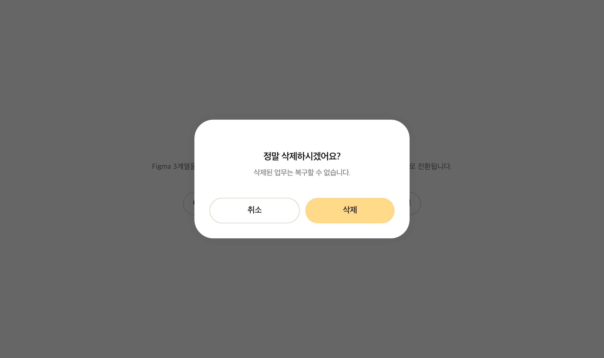
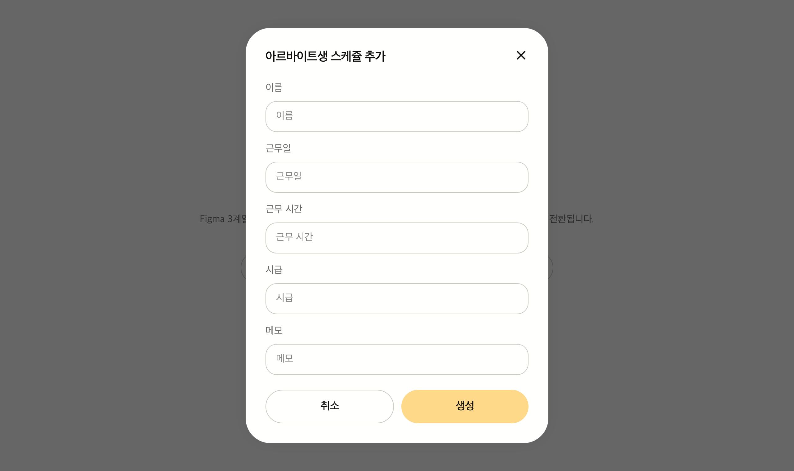
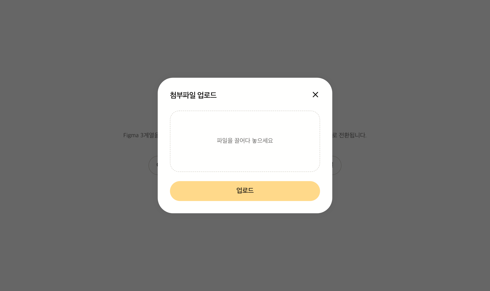
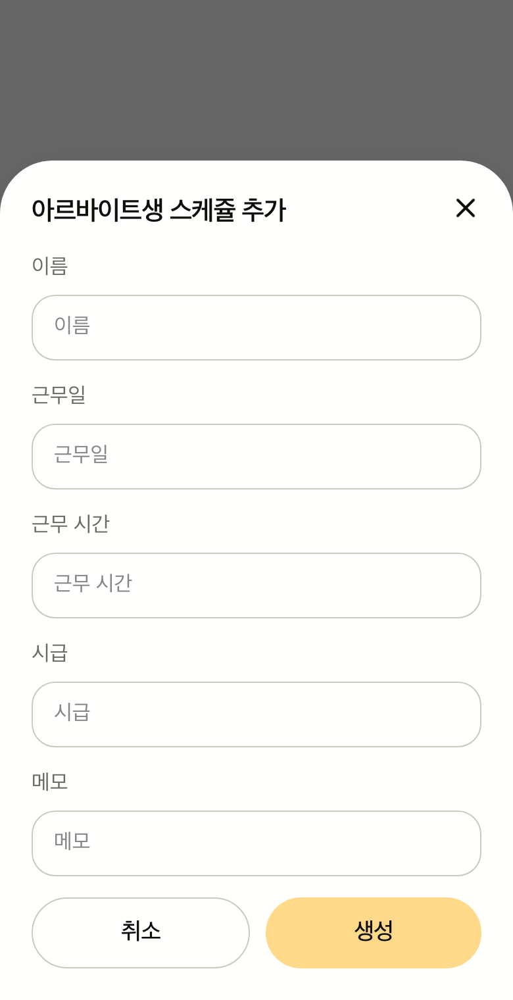
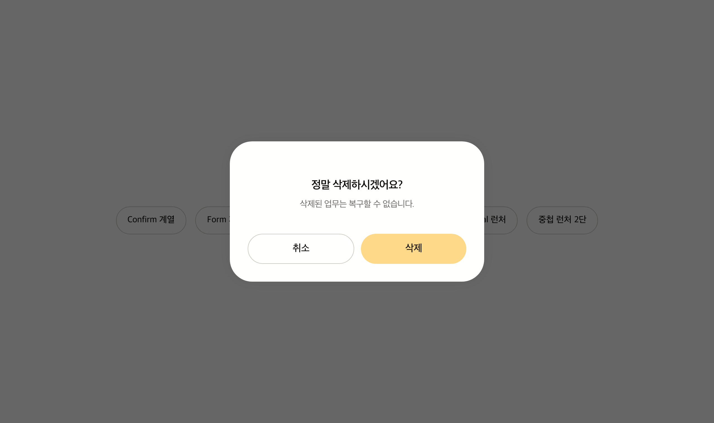
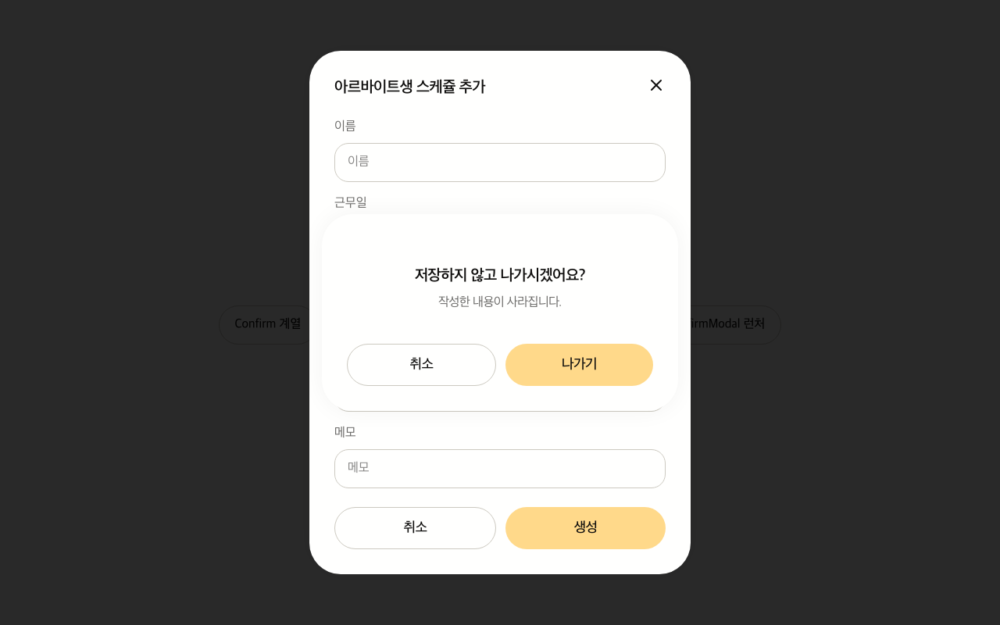

# Modal 컴포넌트 설계

여러 화면에서 반복되는 모달 UI를 하나의 compound 컴포넌트로 통일하기 위한 설계 문서다. 구현은 이 문서를 단일 출처로 삼아 단계별 PR로 진행한다.

## 개요

Figma 디자인에는 모달 전용 컴포넌트 페이지가 없고 화면별 인스턴스로 흩어져 있다. 모달류 노드를 전수 조사한 결과 **골격이 동일하고 슬롯 조합만 다른 3계열**로 수렴했다.

| 계열            | 대표 화면                | Desktop / Tablet | Mobile                         | Header                             | Footer               |
| --------------- | ------------------------ | ---------------- | ------------------------------ | ---------------------------------- | -------------------- |
| Confirm / Alert | 삭제 확인                | 456px 중앙       | 343px 중앙                     | 닫기 없음, **중앙 정렬** 제목·설명 | 취소·확인 2분할      |
| Form            | 아르바이트생 스케줄 추가 | 488px 중앙       | **375px 바텀시트** (하단 앵커) | 제목 좌측 + 닫기 아이콘 24px       | 취소·생성 2분할      |
| Upload / 단순   | 첨부파일 업로드          | 456px 중앙       | 343px 중앙                     | 제목 좌측 + 닫기 아이콘            | 단일 full-width 버튼 |

세 계열 모두 아래 골격을 공유한다.

| 레이어       | 값                                                                               |
| ------------ | -------------------------------------------------------------------------------- |
| Overlay(dim) | `rgba(0, 0, 0, 0.6)` 전체 화면, blur 없음                                        |
| Panel        | `bg-white-50`, `radius 40px`, `padding 32px`, `shadow 0 0 30px rgba(0,0,0,0.05)` |
| 슬롯         | Header(제목 · 설명 · 닫기) / Body / Footer                                       |

**선택형 확인 모달**처럼 Confirm 계열 Body에 선택 박스(`border`, `radius 24px`, `padding 24px`)가 들어가는 변형이 있으므로 **Body는 자유 슬롯**이어야 한다.

### Figma 원본 노드

본문에서는 아래 이름으로 참조한다. 노드 ID는 이 표에서만 관리한다.

| 이름                     | 설명                              | 노드 ID      |
| ------------------------ | --------------------------------- | ------------ |
| 단순 확인 모달           | 문구 + 취소·확인 버튼             | `337:106175` |
| 선택형 확인 모달         | 문구 + 선택 박스 + 취소·확인 버튼 | `337:103204` |
| 스케줄 폼 모달 (Desktop) | 488px, 폼 필드 스크롤             | `337:127681` |
| 스케줄 폼 모달 (Mobile)  | 375px 바텀시트                    | `337:128071` |
| 첨부파일 업로드 모달     | 456px, 단일 버튼                  | `337:126663` |
| Dim 레이어               | 전체 화면 딤                      | `337:127680` |

파일: [Figma — BizSched / design 캔버스](https://www.figma.com/design/0UAYWaDS9UNjigV73HWcPZ/BizSched?node-id=1-65264)

## 설계 결정 요약

| 결정            | 선택                                                | 근거                                                                                                                                                              |
| --------------- | --------------------------------------------------- | ----------------------------------------------------------------------------------------------------------------------------------------------------------------- |
| 범위            | 범용 Modal compound + Confirm 프리셋                | Form·Upload는 도메인에서 조합, 반복되는 삭제 확인만 프리셋화                                                                                                      |
| 기반 primitive  | Base UI `Dialog` (`@base-ui/react`)                 | 포커스 트랩·ESC·스크롤 락·ARIA·**중첩 다이얼로그**를 제공. 직접 구현 시 [accessibility.md](../../convention/accessibility.md)의 WCAG 2.1 AA 목표 달성 비용이 크다 |
| 시작점          | 레지스트리는 참조만 하고 직접 작성                  | `shadcn add dialog`를 실행해 대조한 결과 재구성 후 남는 것이 없어 생성물을 두지 않는다. 아래 "`shadcn add dialog` 검증 결과" 참고                                 |
| 열기/닫기       | `overlay-kit`                                       | `openAsync`로 Confirm 호출부가 한 줄이 된다                                                                                                                       |
| 중첩 모달       | overlay-kit 경로로 통일 + append index 기반 z-index | 트리 중첩과 혼용하면 같은 동작이 두 방식으로 갈린다. 아래 "중첩 모달" 참고                                                                                        |
| 비동기 Body     | **보류** (`@suspensive/react` 미도입)               | 실사용례가 생기는 시점에 도입. 아래 "비동기 Body 전략" 참고                                                                                                       |
| 모바일 바텀시트 | Panel의 variant                                     | Figma상 바텀시트는 Form 계열 1개뿐이라 별도 컴포넌트로 분리할 근거가 부족                                                                                         |

## `shadcn add dialog` 검증 결과

`npx shadcn add dialog`를 실제로 실행해 생성물(`base-nova` 스타일)과 대조했고, **생성물을 저장소에 두지 않기로 했다.** `src/components/_common/ui/`는 비워둔다. 아래는 그 판단의 근거이며, 다른 컴포넌트를 받을 때도 같은 기준으로 판단한다.

### 1. 재구성 후 남는 것이 없다

생성 스타일이 사실상 전부 교체 대상이다.

| shadcn 기본값                               | Figma                                      | 조치          |
| ------------------------------------------- | ------------------------------------------ | ------------- |
| Backdrop `bg-black/10` + `backdrop-blur-xs` | `rgba(0,0,0,0.6)`, blur 없음               | 교체          |
| Popup `rounded-xl p-4 sm:max-w-sm`          | `rounded-[40px] p-8 w-[456px]`/`w-[488px]` | 교체          |
| `DialogContent`에 닫기 버튼 하드코딩        | Confirm 계열은 닫기 없음                   | 슬롯으로 분리 |
| Footer `-mx-4 border-t bg-muted/50`         | 배경·보더 없음, 버튼 2분할                 | 교체          |
| Title `text-base font-medium`               | `20px / 600`, Confirm은 중앙 정렬          | variant화     |

교체하고 나면 `Portal + Backdrop + Popup` 합성 구조만 남는데, 이는 `@base-ui/react/dialog`의 타입 정의만 보고도 나오는 형태다. 실제로 문서만 보고 작성한 `ModalPanel`과 레지스트리의 `DialogContent`가 같은 구조로 수렴했다.

### 2. 경유해도 업스트림 개선이 따라오지 않는다

shadcn은 의존성이 아니라 코드 생성기다. 생성된 파일은 그 시점부터 이 저장소의 파일이고, 재실행은 병합이 아니라 덮어쓰기다. `import { cn } from "cn"` 같은 수정도 재생성할 때마다 다시 해야 한다. 실제 동작 개선(포커스 트랩·ESC·스크롤 락·ARIA)은 semver 의존성인 `@base-ui/react`에서 오며, Modal은 이미 거기에 직접 붙어 있다. **생성물을 한 겹 끼우는 것으로 얻는 추종 효과는 없다.**

### 3. 경유 비용은 실재한다

- `registryDependencies: ["button"]` — Button이 함께 생성된다. Button은 아직 설계 전이라 이후 설계와 충돌한다.
- `sm:max-w-sm`(Popup), `sm:flex-row sm:justify-end`(Footer) — [style.md](../../convention/style.md)의 `--breakpoint-*: initial` 때문에 **클래스 자체가 생성되지 않는다.** 그대로 쓰면 반응형이 조용히 사라진다.
- 파일명이 `dialog.tsx`(lowercase)라 [naming.md](../../convention/naming.md)의 `Name.tsx` 규칙과 충돌한다. 생성물은 재생성 가능해야 하므로 이름을 고칠 수도 없다.
- override로 덮은 부분은 상위 클래스가 바뀌어도 어긋난 사실을 알려주지 않는다.

### 실행 기록

| 항목                                                                           | 결과                                                                                          |
| ------------------------------------------------------------------------------ | --------------------------------------------------------------------------------------------- |
| `components.json` · `package.json` · `app/globals.css`                         | 변경 없음                                                                                     |
| `import { IconPlaceholder } from "@/app/(create)/components/icon-placeholder"` | **CLI가 자동 치환** — `iconLibrary: "lucide"` 설정대로 `XIcon` 직접 import로 생성된다         |
| Button import 경로                                                             | `components.json`의 alias대로 `@components/_common/ui/button`으로 생성된다                    |
| `import { cn } from "cn"`                                                      | 치환되지 않는다. 이 저장소는 `@lib/utilities/cn` 재export를 단일 출처로 쓰므로 수동 수정 필요 |

### 언제 생성물을 쓰는가

동작 로직이 무겁고 디자인 차이가 토큰 수준인 컴포넌트(Table·Select·Checkbox 등)는 교체율이 낮아 생성물이 그대로 값을 한다. Dialog는 반대 사례였다 — 동작은 Base UI가 전부 제공하고 디자인은 전부 다르다.

## 레이어 구조

```
① Primitive  src/components/_common/Modal/         Base UI Dialog 래핑 · 도메인 무지 · compound
② Preset     src/components/_common/Modal/         ConfirmModal (Figma Confirm 계열 고정 조합)
③ Launcher   src/components/_common/Modal/         overlay 어댑터 + 호출 API (Provider는 providers/overlay/)
```

`_common/ui/`는 **shadcn/ui CLI가 생성한 파일 전용**이다. 직접 작성·재구성한 컴포넌트는 `_common/Modal/`처럼 `_common/` 바로 아래 컴포넌트 폴더에 둔다. 따라서 primitive와 preset이 같은 폴더를 쓰며, `ConfirmModal`은 문구·버튼 구성이 서비스 맥락을 갖는다는 점만 파일 이름으로 구분된다.

### 파일 구성

```
src/components/_common/Modal/
├── Modal.tsx             # 네임스페이스 합성 (Modal.Panel …)
├── ModalRoot.tsx         # Dialog.Root + ModalProvider
├── ModalPanel.tsx        # Portal + Backdrop + Popup (cva: size, placement, backdrop)
├── ModalHeader.tsx       # cva: align
├── ModalTitle.tsx        # Dialog.Title
├── ModalDescription.tsx  # Dialog.Description
├── ModalCloseButton.tsx  # Dialog.Close — 기본 X 아이콘 버튼, render로 위임 가능
├── ModalBody.tsx         # 자유 슬롯 (스크롤 영역)
├── ModalFooter.tsx       # cva: layout
├── ConfirmModal.tsx      # Confirm 계열 프리셋
├── ConfirmModalController.tsx  # 프리셋의 overlay-kit 어댑터 (stackIndex 계산)
└── openConfirmModal.tsx  # overlay.openAsync 호출 API

src/providers/modal/
└── ModalProvider.tsx     # stackIndex 컨텍스트

src/providers/types/
└── modal.ts              # ModalContextValue · ModalProviderProps

src/hooks/modal/
└── useModalContext.ts    # 컨텍스트 소비 훅

src/providers/overlay/
└── OverlayProvider.tsx   # overlay-kit Provider 래핑

src/hooks/overlay/
└── useOverlayStackIndex.ts   # 중첩 z-index 계산
```

각 파일은 개별 named export를 유지하고, `Modal.tsx`는 dot-notation만 **추가로** 제공한다. 서브컴포넌트를 직접 import할 수도 있으므로 [code-style.md](../../convention/code-style.md)의 배럴 `index.ts` 금지 규칙에 걸리지 않는다.

`OverlayProvider`는 `src/providers/overlay/`에 둔다(확정). Context·Provider는 `providers/`, 소비 훅은 `hooks/`에 두는 규칙을 따른다.

### 컨트롤러·launcher를 `_common/Modal/`에 두는 이유 (확정)

`ConfirmModalController`와 `openConfirmModal`은 처음에 `lib/utilities/overlay/`에 있었으나 **프리셋 폴더로 옮겼다.** 근거는 두 가지다.

- 둘 다 `ConfirmModal`을 쓰는 하나의 방법, 즉 프리셋의 일부다. primitive와 preset은 어차피 같은 폴더를 쓴다(위 "레이어 구조"). 프리셋 하나가 UI·어댑터·호출 API 세 파일로 한자리에 모인다.
- `lib/utilities/`는 `cn.ts` 같은 순수 함수가 있는 자리다. 훅을 호출하는 React 컴포넌트와 특정 컴포넌트 전용 API가 섞이지 않게 한다.

**overlay-kit에 의존하지 않아야 하는 것은 폴더가 아니라 primitive 파일**(`ModalRoot`·`ModalPanel` 등)이며, 이 배치에서도 그대로 지켜진다. `openConfirmModal.tsx`는 컴포넌트가 아니므로 [folder-structure.md](../../architecture/folder-structure.md)의 "기타 utility·핸들러 파일명은 `camelCase`" 규칙을 따라 camelCase를 쓴다.

새 프리셋에 launcher를 붙일 때도 같은 형태를 따른다 — `XxxModal.tsx` · `XxxModalController.tsx` · `openXxxModal.tsx`.

## Compound API

```tsx
// Form 계열 — 스케줄 폼 모달
<Modal open={isOpen} onOpenChange={setOpen}>
  <Modal.Panel size="md" placement="sheetOnMobile">
    <Modal.Header align="start">
      <Modal.Title>아르바이트생 스케쥴 추가</Modal.Title>
      <Modal.CloseButton />
    </Modal.Header>
    <Modal.Body>{/* 폼 필드 */}</Modal.Body>
    <Modal.Footer layout="split">
      <Modal.CloseButton render={<Button variant="outline">취소</Button>} />
      <Button type="submit">생성</Button>
    </Modal.Footer>
  </Modal.Panel>
</Modal>
```

```tsx
// Upload 계열 — 첨부파일 업로드 모달. 같은 부품, 다른 조합
<Modal.Footer layout="single">
  <Button>업로드</Button>
</Modal.Footer>
```

```tsx
// Confirm 계열 — 단순 확인 모달. 닫기 버튼 없음, 중앙 정렬
<Modal.Header align="center">
  <Modal.Title>정말 삭제하시겠어요?</Modal.Title>
  <Modal.Description>삭제된 업무는 복구할 수 없습니다.</Modal.Description>
</Modal.Header>
```

Figma 3계열이 **부품 추가 없이 조합만으로** 나온다. 새 모달이 필요할 때도 같은 부품을 재조합한다.

### 슬롯 책임

| 슬롯                | 책임                                                | 비고                                |
| ------------------- | --------------------------------------------------- | ----------------------------------- |
| `Modal`             | `open`·`onOpenChange` 제어, Base UI `Dialog.Root`   | overlay-kit 사용 시 launcher가 주입 |
| `Modal.Panel`       | Portal · Backdrop · Popup · 크기 · 배치 · 딤        | 애니메이션 진입점                   |
| `Modal.Header`      | 제목·설명·닫기 배치                                 | `align`으로 좌측/중앙 전환          |
| `Modal.Title`       | `Dialog.Title` — `aria-labelledby` 자동 연결        | **모든 모달에 필수**                |
| `Modal.Description` | `Dialog.Description` — `aria-describedby` 자동 연결 | 선택                                |
| `Modal.CloseButton` | `Dialog.Close` — 닫기 동작                          | 아래 참고                           |
| `Modal.Body`        | 자유 슬롯. 내용 초과 시 스크롤                      | 폼·선택 박스·업로드 인풋 모두 수용  |
| `Modal.Footer`      | 액션 버튼 배치                                      | `layout`으로 2분할/단일 전환        |

### `Modal.CloseButton`

닫기는 **헤더 우상단 X 아이콘**과 **푸터 취소 버튼** 두 자리에서 필요하다. 둘 다 "모달을 닫는다"는 같은 동작이므로 부품을 하나로 둔다.

```tsx
// 기본 — X 아이콘 버튼. aria-label과 sr-only 텍스트를 내장한다
<Modal.CloseButton />

// render로 위임 — 임의 요소가 닫기 동작을 가져간다
<Modal.CloseButton render={<Button variant="outline">취소</Button>} />
```

- 위치(우상단 등)는 `Modal.Header`의 레이아웃이 정한다. `CloseButton` 자신은 위치를 갖지 않는다.
- Base UI `Dialog.Close`의 `render` prop을 그대로 노출하므로 별도 API를 만들지 않는다.
- Confirm 계열은 이 부품을 **쓰지 않는다.** 취소 버튼이 그 역할을 대신한다.

## variant (cva)

[ui-component.md](../../convention/ui-component.md)에 따라 반복되는 디자인 차이만 `cva`로 정의한다.

| 컴포넌트 | 축          | 값              | 매핑                                               |
| -------- | ----------- | --------------- | -------------------------------------------------- |
| `Panel`  | `size`      | `sm`            | `w-[456px] max-tablet:w-[343px]`                   |
|          |             | `md`            | `w-[488px] max-tablet:w-full`                      |
| `Panel`  | `placement` | `center`        | 화면 중앙 고정                                     |
|          |             | `sheetOnMobile` | `max-tablet:`에서 하단 앵커 + 상단 모서리만 라운드 |
| `Panel`  | `backdrop`  | `dim`           | `bg-overlay` — `stackIndex 0`일 때 기본값          |
|          |             | `transparent`   | 배경색 없음 — `stackIndex 1` 이상일 때 기본값      |
| `Header` | `align`     | `start`         | Form · Upload                                      |
|          |             | `center`        | Confirm                                            |
| `Footer` | `layout`    | `split`         | 버튼 2개 `flex-1`                                  |
|          |             | `single`        | 버튼 1개 full-width                                |

패딩은 전 계열 공통 `p-8 max-tablet:p-6` (32px → 24px). [style.md](../../convention/style.md)의 **desktop-first + `max-*` 전용** 규칙을 따르며 `min-*` 변형과 혼용하지 않는다.

## 구현 결과

PR 2 구현본을 임시 프리뷰 화면으로 렌더한 결과다. 프리뷰 화면 자체는 저장소에 포함하지 않는다.

| Confirm 계열 (456px)                              | Form 계열 (488px)                           |
| ------------------------------------------------- | ------------------------------------------- |
|  |  |

| Upload 계열 (456px)                             | Form 계열 모바일 바텀시트 (390px)                   |
| ----------------------------------------------- | --------------------------------------------------- |
|  |  |

`ConfirmModal` 프리셋(PR 3)은 Body가 없을 때 `pt-16`·`gap-10` 규칙이 적용된다. 실측 결과 `width 456px`, `padding-top 64px`, `row-gap 40px`로 위 "Confirm 프리셋" 표와 일치한다.



## 중첩 모달

모달 위에 모달을 띄우는 경우 **overlay-kit 경로로 통일한다.** 쌓임 순서는 overlay-kit의 append 순서를 z-index에 반영해 명시적으로 제어한다.

### 왜 overlay-kit 경로인가

Base UI는 React 트리상 중첩된 다이얼로그를 자체 지원한다(`data-nested`, `--nested-dialogs`, 자식 backdrop 자동 억제). 하지만 overlay-kit으로 연 모달들은 Provider 아래 **형제로 렌더**되므로 Base UI가 중첩으로 인식하지 못하고, 이 기능은 적용되지 않는다.

트리 중첩과 overlay-kit을 혼용하면 같은 "모달 위 모달"이 두 가지 다른 방식으로 동작하게 된다. **한쪽으로 고정하고, Base UI가 대신 해주지 않는 부분(쌓임 순서·딤 중복)을 직접 정의한다.**

### 동작 근거

overlay-kit 구현을 확인한 결과는 다음과 같다.

- 새 오버레이는 내부 `overlayOrderList`에 **열린 순서대로 append**되고, Provider가 `children` 뒤에 그 순서로 렌더한다
- `useOverlayData()`가 오버레이 레코드를 열린 순서대로 돌려주고, `useCurrentOverlay()`가 최상위 오버레이 id를 돌려준다

DOM 순서만으로도 나중에 연 모달이 위에 오지만, Base UI `Portal`이 팝업을 `document.body`로 옮기고 다른 전역 레이어(토스트 등)와 섞일 수 있으므로 **z-index를 명시한다.**

### z-index 규칙

오버레이의 **append index**를 그대로 z-index 단계로 쓴다.

```
--z-modal-base: 1000   /* 신설 토큰 */

backdrop  z-index = --z-modal-base + stackIndex * 10
popup     z-index = --z-modal-base + stackIndex * 10 + 1
```

한 모달 안에서 popup이 자기 backdrop 위에 와야 하므로 단계 간격을 `10`으로 두고 popup에 `+1`을 준다. 간격은 나중에 모달 내부에 별도 레이어가 필요해질 때를 위한 여유다.

`Modal.Panel`이 자신의 `stackIndex`를 CSS 변수로 내려주고, backdrop·popup이 계산식으로 참조한다.

```tsx
// ModalPanel.tsx
<div style={{ '--modal-stack-index': stackIndex }}>
  <Dialog.Backdrop className="z-[calc(var(--z-modal-base)+var(--modal-stack-index)*10)]" />
  <Dialog.Popup className="z-[calc(var(--z-modal-base)+var(--modal-stack-index)*10+1)]" />
</div>
```

`stackIndex`는 전용 훅으로 구한다.

```ts
// src/hooks/overlay/useOverlayStackIndex.ts
export const useOverlayStackIndex = (overlayId?: string) => {
  const overlayData = useOverlayData();

  if (overlayId == null) {
    return 0;
  }

  const index = Object.keys(overlayData).indexOf(overlayId);

  return index < 0 ? 0 : index;
};
```

`overlayId`는 overlay-kit이 컨트롤러에 넘겨주는 값이다. **훅 호출은 컨트롤러가 하고, primitive에는 계산된 숫자만 내려간다.** `ConfirmModalController`가 `<Modal stackIndex={useOverlayStackIndex(overlayId)}>`로 전달하면 `ModalRoot`가 `ModalProvider`로 컨텍스트에 싣고 `Modal.Panel`이 `useModalContext()`로 읽는다. primitive가 overlay-kit에 직접 의존하지 않도록 이 방향을 유지한다. overlay-kit을 거치지 않고 직접 `<Modal>`을 쓰면 `stackIndex`는 기본값 `0`이다.

### 딤 중복

z-index는 순서만 해결한다. **딤은 별개 문제다.** 자식 backdrop이 억제되지 않으므로 `rgba(0,0,0,0.6)`이 두 번 겹쳐 `0.84`가 된다.

`Modal.Panel`의 `backdrop` 축이 이를 처리한다.

| `stackIndex` | `backdrop` 기본값 | 동작                                                 |
| ------------ | ----------------- | ---------------------------------------------------- |
| `0`          | `dim`             | `bg-overlay` 적용                                    |
| `1` 이상     | `transparent`     | 배경색 없음. 요소는 렌더해 바깥 클릭 처리를 유지한다 |

기본값은 `stackIndex`에서 자동으로 결정되며, `backdrop` prop으로 명시하면 그 값이 우선한다.

### 사용 예

가장 흔한 사례는 폼 모달에서 닫기를 눌렀을 때 확인을 받는 경우다. 부모 모달 안에서 `openConfirmModal`을 호출하면 자식이 `stackIndex 1`로 열린다.

```tsx
const handleClose = async () => {
  if (!isDirty) {
    close();
    return;
  }

  const isDiscarded = await openConfirmModal({
    title: '저장하지 않고 나가시겠어요?',
    description: '작성한 내용이 사라집니다.',
  });

  if (isDiscarded) {
    close();
  }
};
```

### 중첩 동작 검증 결과 (PR 3에서 확인)

`openConfirmModal`로 모달 두 개를 연 상태를 브라우저에서 실측했다.

| 확인 항목                  | 결과                                                                            |
| -------------------------- | ------------------------------------------------------------------------------- |
| 쌓임 순서                  | panel z-index가 `1001` → `1011`로 분리된다                                      |
| 딤 중복                    | 2번째 backdrop이 `rgba(0, 0, 0, 0)`이 되어 겹치지 않는다                        |
| 포커스 트랩·스크롤 락 충돌 | 충돌 없음. `body`가 `overflow: hidden`을 유지하고 **모두 닫힌 뒤에만** 해제된다 |
| 포커스 복귀                | 자식이 닫히면 포커스가 부모 모달 안으로 돌아온다                                |
| ESC 전파                   | ESC 1회에 최상위 모달만 닫히고, 부모는 열린 상태로 남는다                       |
| launcher resolve           | ESC·취소로 닫으면 `false`로 resolve된다                                         |

`overlayId`는 **고정값으로 넘기지 않는다.** 같은 id로 두 번 열면 overlay-kit이 오류를 던지고(`You can't open the multiple overlays with the same overlayId`), 재사용된 id는 `overlayData`상 위치가 갱신되지 않아 `stackIndex`가 어긋난다. 자동 생성 id를 그대로 쓴다. 중첩 깊이 상한은 두지 않는다.

### 경로를 섞으면 안 되는 이유 (실측)

부모를 `useState`로 직접 열고 자식만 `openConfirmModal`로 열면, 자식은 overlay-kit 기준 **첫 번째 오버레이라서 `stackIndex`가 `0`이 된다.** 그 결과 두 panel의 z-index가 `1001`로 같아지고 딤이 두 번 겹쳐 `0.84`가 된다.



**모달 위에 모달을 띄울 때는 부모도 반드시 overlay-kit으로 연다.**

## 디자인 토큰 매핑

### 일치 (그대로 사용)

| Figma                     | 코드 토큰                            |
| ------------------------- | ------------------------------------ |
| Panel 배경                | `--color-white-50`                   |
| 제목 `20px / 30px`        | `--text-xl` (`1.25rem` / `1.875rem`) |
| 설명 `16px / 24px`        | `--text-base` (`1rem` / `1.5rem`)    |
| 버튼 텍스트 `18px / 28px` | `--text-lg` (`1.125rem` / `1.75rem`) |

### 신설 필요

| 토큰              | 값                             | 이유                                                                            |
| ----------------- | ------------------------------ | ------------------------------------------------------------------------------- |
| `--color-overlay` | `rgba(0, 0, 0, 0.6)`           | 딤 색이 토큰에 없다                                                             |
| `--radius-modal`  | `2.5rem` (40px)                | `--radius: 0.625rem` 기준 최대가 `--radius-4xl`(26px)이라 40px를 표현할 수 없다 |
| `--shadow-modal`  | `0 0 30px rgba(0, 0, 0, 0.05)` | 그림자 토큰이 없다                                                              |
| `--z-modal-base`  | `1000`                         | 중첩 모달의 z-index 기준점. 아래 "중첩 모달" 참고                               |

### 방침 — Description 색상은 대비 우선 (확정)

Figma의 Description은 `#EBDDB9`(`--color-secondary-600`)이지만, Panel 배경이 `--color-white-50`(`#FFFFFE`)이라 대비가 **약 1.3:1**로 [accessibility.md](../../convention/accessibility.md)의 WCAG 2.1 AA 목표(본문 4.5:1)에 크게 못 미친다. `ModalDescription`은 `text-muted-foreground`(`--color-slate-400`, `#6B6A68`, 약 5.3:1)를 쓴다.

Figma 값을 되살리려면 Description이 놓이는 배경을 먼저 바꿔야 한다.

### 방침 — 컬러는 CSS 토큰 기준 (확정)

**`src/assets/styles/colors.css`의 값을 기준으로 삼는다.** 제목은 `text-foreground`, 보더는 `border-*`처럼 토큰을 참조하고 Figma의 hex를 하드코딩하지 않는다. 나중에 토큰만 고치면 전체가 따라온다.

아래는 기록용 차이표다. 이름은 같은데 값이 다르며, Figma의 slate 계열이 순수 무채색인 반면 코드 토큰은 따뜻한 색조가 섞여 있다. **적용값은 항상 오른쪽 열이다.**

| 스타일명    | Figma     | colors.css (**적용값**) |
| ----------- | --------- | ----------------------- |
| `slate/300` | `#CCCCCC` | `#999797`               |
| `slate/500` | `#737373` | `#1C1917`               |
| `slate/800` | `#262626` | `#131110`               |

### 방침 — letter-spacing은 인라인 (확정)

Figma의 제목·설명·버튼 텍스트가 모두 `-0.03em`(각각 `-0.6px` / `-0.48px` / `-0.54px`)을 쓴다. **`--tracking-*` 토큰을 신설하지 않고 `tracking-[-0.03em]` 임의값을 인라인으로 적용한다.** 모달 외에 쓰이는 곳이 확인되지 않아 토큰화할 근거가 부족하다.

## Confirm 프리셋

Figma의 Confirm 계열은 **Body 유무에 따라 상단 여백과 간격이 다르다.**

| 구성                       | 참조             | padding                          | gap           |
| -------------------------- | ---------------- | -------------------------------- | ------------- |
| Body 없음 (문구 + 버튼)    | 단순 확인 모달   | `pt-16 px-8 pb-8` (64 / 32 / 32) | `gap-10` (40) |
| Body 있음 (선택 박스 포함) | 선택형 확인 모달 | `p-8` (32)                       | `gap-4` (16)  |

Body가 없을 때 상단 여백을 키워 시각 중심을 맞춘 것이다. 이 규칙은 **`ConfirmModal` 프리셋 안에서** 처리하고 `Modal.Panel`의 variant로 올리지 않는다. Confirm 계열에만 해당하는 규칙을 primitive가 알 필요는 없다.

## overlay-kit 연동

`stackIndex`를 구하려면 훅을 호출해야 하므로, 컨트롤러를 컴포넌트로 한 겹 감싼다. 훅 호출이 컨트롤러에 머무르고 `ConfirmModal`은 숫자만 받는다. 컨트롤러와 launcher는 프리셋과 같은 폴더에 **파일을 나눠** 둔다.

```tsx
// src/components/_common/Modal/ConfirmModalController.tsx
function ConfirmModalController({
  overlayId,
  isOpen,
  close,
  unmount,
  ...content
}) {
  const stackIndex = useOverlayStackIndex(overlayId);

  return (
    <ConfirmModal
      {...content}
      stackIndex={stackIndex}
      open={isOpen}
      onOpenChange={(open) => !open && close(false)}
      onConfirm={() => close(true)}
      onExitComplete={unmount}
    />
  );
}
```

```tsx
// src/components/_common/Modal/openConfirmModal.tsx
const openConfirmModal = (content: ConfirmModalContent) =>
  overlay.openAsync<boolean>((controller) => (
    <ConfirmModalController {...content} {...controller} />
  ));
```

overlay-kit이 컨트롤러 콜백에 넘기는 `{ overlayId, isOpen, close, unmount }`가 `ConfirmModalController`의 props 이름과 그대로 맞으므로 launcher는 스프레드 한 줄로 끝난다.

```tsx
// 호출부 — isOpen 상태가 필요 없다
const isConfirmed = await openConfirmModal({
  title: '정말 삭제하시겠어요?',
  description: '삭제된 업무는 복구할 수 없습니다.',
  confirmText: '삭제',
});

if (isConfirmed) {
  deleteTask();
}
```

`src/providers/overlay/OverlayProvider.tsx`(`"use client"`)를 `app/layout.tsx`의 `<body>` 안에 마운트한다. `layout.tsx` 자체는 Server Component로 남는다.

> **제약**: 오버레이는 Provider가 선언된 위치에 렌더된다. 따라서 Provider보다 **하위 트리의 Context에는 접근할 수 없다.** 모달에 넘길 값은 props로 전달한다. `QueryClientProvider`처럼 최상위에 있는 Context는 정상 동작한다.

## 비동기 Body 전략 (보류)

[rendering.md](../../architecture/rendering.md)는 **모달 내부 데이터를 prefetch 대상에서 제외**한다. 따라서 모달 Body가 서버 데이터를 읽는 경우 pending·error 상태가 반드시 생긴다.

현시점에서는 `Modal.Body`를 **어떤 경계든 끼워 넣을 수 있는 자유 슬롯**으로 열어두는 데서 멈춘다. 이 저장소에는 아직 TanStack Query 사용처가 없어, 실사용례 없이 API를 확정하면 잘못된 추상화가 굳는다.

비동기 Body가 실제로 필요해지는 기능 구현 시점에 다음을 검토한다.

- `@suspensive/react`의 `<ErrorBoundary>`(React 19에도 내장 없음), `<ErrorBoundaryGroup>`, `<Delay>`(스피너 깜빡임 방지)
- 위를 묶은 `Modal.AsyncBody` 도입 여부

## 접근성

Base UI `Dialog`가 포커스 트랩, ESC 닫기, 스크롤 락, `aria-labelledby`/`aria-describedby`를 담당한다. [accessibility.md](../../convention/accessibility.md) 기준으로 아래를 추가로 지킨다.

- `Modal.Title`은 **모든 모달에 필수**다. 생략하면 스크린리더가 모달을 식별하지 못한다.
- Confirm 계열은 닫기 버튼이 없지만 **ESC와 취소 버튼으로 탈출 가능**해야 한다.
- `tw-animate-css`의 `animate-in`/`animate-out`에 `motion-reduce:` 대응을 넣는다.
- `Modal.CloseButton`의 기본 아이콘 버튼에는 `sr-only` 텍스트를 넣는다.
- 모달이 닫히면 포커스가 **열었던 트리거로 복귀**해야 한다. overlay-kit으로 여는 경우 트리거 요소가 유지되는지 확인한다.

## 렌더링 경계

`"use client"`는 상태·이벤트가 실제로 필요한 **말단 파일에만** 둔다([rendering.md](../../architecture/rendering.md) 트리거 1·3·4).

- `ModalRoot.tsx`, `ModalPanel.tsx` 등 Base UI를 쓰는 파일: 클라이언트 경계
- Server Component가 `<Modal>`을 렌더해도 **부모는 클라이언트가 되지 않는다** (같은 문서 "UI primitive의 클라이언트 경계는 전염되지 않는다")
- `Modal.Body`에 서버 콘텐츠를 `children`으로 주입하는 경로를 열어둔다

## 테스트 전략

[test.md](../../convention/test.md)에 따라 `test/`가 `src/` 구조를 미러링한다.

```
test/components/_common/Modal/modal.test.tsx
test/components/_common/Modal/confirmModal.test.tsx
test/components/_common/Modal/confirmModalController.test.tsx
test/components/_common/Modal/openConfirmModal.test.tsx
```

| 대상      | 검증                                                                                                                                 |
| --------- | ------------------------------------------------------------------------------------------------------------------------------------ |
| 슬롯 렌더 | Header/Body/Footer 조합별 렌더, `Modal.Title` 없는 조합이 만들어지지 않는지                                                          |
| 닫기 경로 | ESC, backdrop 클릭, `Modal.CloseButton` 클릭, `render` 위임 시 동작                                                                  |
| 접근성    | `role="dialog"`, `aria-labelledby`/`aria-describedby` 연결, 포커스 트랩                                                              |
| variant   | `size`·`placement`·`backdrop`·`align`·`layout` 클래스 적용                                                                           |
| 중첩      | `stackIndex`에 따른 z-index 계산, 2번째 이후 backdrop이 `transparent`인지, ESC가 최상위만 닫는지, 닫힌 뒤 포커스가 부모로 복귀하는지 |
| launcher  | `openConfirmModal`이 확인 시 `true`, 취소·ESC 시 `false`로 resolve                                                                   |

## 단계별 PR 계획

GitHub [stacked pull requests](https://docs.github.com/en/pull-requests/get-started/about-stacked-prs)로 진행한다. 각 브랜치는 바로 아래 브랜치를 base로 하고, 맨 아래만 `dev`를 향한다. 아래부터 Squash Merge하면 남은 PR의 base가 자동으로 리타깃된다.

| 순서 | 브랜치                      | base                        | 내용                                                               |
| ---- | --------------------------- | --------------------------- | ------------------------------------------------------------------ |
| 1    | `feat/common-modal`         | `dev`                       | **이 설계 문서** + docs 인덱스 · AGENTS.md 갱신                    |
| 2    | `feat/common-modal-ui`      | `dev`                       | 토큰 4종 추가 + Modal compound 구현 (PR #27)                       |
| 3    | `feat/common-modal-overlay` | `feat/common-modal-ui`      | overlay-kit 도입 + `ConfirmModal` + Provider + 중첩 검증 (진행 중) |
| 4    | `feat/common-modal-test`    | `feat/common-modal-overlay` | Vitest 테스트                                                      |

중간 브랜치를 수정하면 `gh stack rebase --upstack`으로 위쪽에 전파한다.

> **참고**: stacked pull requests는 GitHub public preview 기능이다. `BizSched/frontend`의 default branch가 `dev`이므로 자동 리타깃 대상이 그대로 `dev`가 된다.

## 확인 필요

아래 항목은 **임의로 확정하지 않는다.** 확인 후 이 문서에 반영한다.

컬러 토큰과 letter-spacing은 확정됐다 — "디자인 토큰 매핑"의 방침 두 절을 따른다.

### 1. Button 컴포넌트 의존

`Modal.Footer`와 `Modal.CloseButton`의 `render`는 Button을 받는다. Button이 아직 없어 **`ConfirmModal`은 임시로 `<button>`에 Figma 값(`rounded-full`, `py-3`, `text-lg`)을 직접 넣어 두었다.** Button 설계가 끝나면 이 두 자리를 교체한다.

### 2. 바텀시트 상호작용 범위

Figma에는 모바일 Form 모달이 하단 앵커로만 그려져 있고 **드래그로 닫기·스냅 포인트 같은 제스처는 정의되어 있지 않다.** 스크롤 가능한 패널로만 구현할지 확인이 필요하다.

Provider 위치와 중첩 동작, `folder-structure.md` 갱신은 확정·반영됐다 — "중첩 동작 검증 결과"와 "파일 구성"을 참고한다.

## 참고

- 공통 UI 배치·`cva`·`cn` 규칙: [convention/ui-component.md](../../convention/ui-component.md)
- 렌더링 경계 금지 목록: [architecture/rendering.md](../../architecture/rendering.md)
- 상태 도구 선택: [architecture/state-management.md](../../architecture/state-management.md)
- 전체 문서 인덱스: [docs/README.md](../../README.md)
